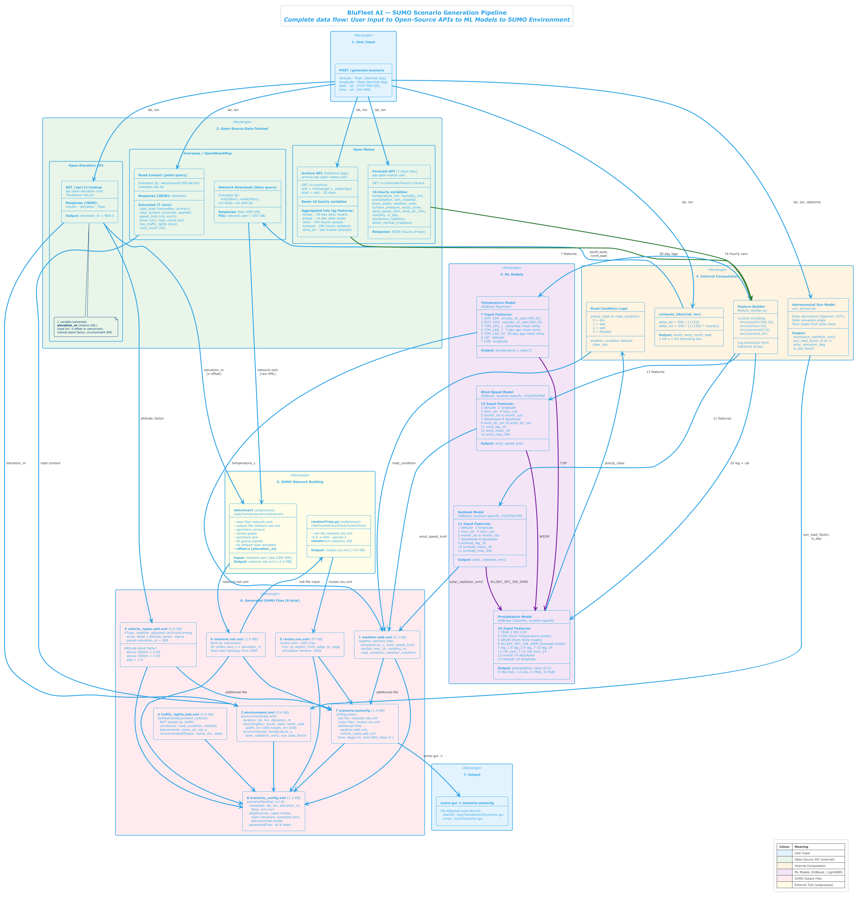

# SUMO Scenario Generation API

**Production-ready REST API** that generates SUMO-compatible scenario files from geographic coordinates and datetime.

Combines real-time weather data (Open-Meteo), elevation data, solar radiation calculations, and ML model predictions to produce environment-aware SUMO simulation configurations.

---

## Architecture Overview

```
┌─────────────────────────────────────────────────────────────────────┐
│                    POST /generate-scenario                         │
│                  { lat, lon, date, time }                          │
└─────────────────────┬───────────────────────────────────────────────┘
                      │
              ┌───────▼────────┐
              │ Decision Engine │──── date within 10 days? ──┐
              └───────┬────────┘                             │
                      │ NO                                   │ YES
          ┌───────────▼───────────┐               ┌──────────▼──────────┐
          │   ML Model Pipeline   │               │  Open-Meteo Forecast│
          │ ┌───────────────────┐ │               │  (direct API call)  │
          │ │ Historical Lags   │ │               └──────────┬──────────┘
          │ │ Feature Builder   │ │                          │
          │ │ XGBoost/LightGBM  │ │                          │
          │ └───────────────────┘ │                          │
          │  Predicts:            │                          │
          │  • Temperature        │                          │
          │  • Wind Speed         │                          │
          │  • Solar Radiation    │                          │
          │  • Precipitation      │                          │
          └───────────┬───────────┘                          │
                      │                                      │
              ┌───────▼──────────────────────────────────────▼───────┐
              │              Environment Features Merge              │
              │  + Elevation (Open-Elevation API)                    │
              │  + Sun Load (astronomical model)                     │
              │  + Road Context (OSM / Overpass API)                 │
              └──────────────────────┬───────────────────────────────┘
                                     │
              ┌──────────────────────▼───────────────────────────────┐
              │              SUMO XML Generator                      │
              │  • weather.add.xml     (friction, visibility, wind)  │
              │  • environment.xml     (full env specification)      │
              │  • vehicle_types.xml   (speed/behaviour adjustments) │
              │  • traffic_lights.xml  (clearance time adjustments)  │
              │  • scenario_config.xml (metadata)                    │
              └─────────────────────────────────────────────────────┘
```

---

## ML Models

| Model | Framework | Features | Output |
|-------|-----------|----------|--------|
| **Temperature** | XGBoost | 7 (DOY sin/cos, lag-1/7/30, lat, lon) | Regression (°C) |
| **Precipitation** | LightGBM/XGBoost | 16 (date, T2M, wind, solar, lags, rolling sums) | 4-class (No/Low/Moderate/High Rain) |
| **Sunload** | XGBoost | 11 (lat, lon, hour/month cyclical, lag features) | Regression (W/m²) |
| **Wind Speed** | XGBoost | 13 (lat, lon, hour/month cyclical, direction, lags) | Regression (km/h) |

Models are auto-loaded from `mlmodels/MODELS/` at startup.

### Detailed Architecture

> Full pipeline diagram — from user input through open-source data fetching, ML model inference, to SUMO file generation.



> 📄 Source: [`architecture/sumo_api_pipeline.puml`](architecture/sumo_api_pipeline.puml)

#### Data Pipeline Flow

```
User Input (lat, lon, date, time)
    │
    ├──► Open-Elevation API ──► elevation_m (909.0m)
    │         Used for: netconvert z-offset, vehicle decel factor
    │
    ├──► Overpass / OSM ──► Road Context (7 vars)
    │    │                    road_type, surface, speed_limit,
    │    │                    lanes, road_name, has_tls, road_count
    │    │
    │    └──► Network Download (bbox) ──► network.osm ──► netconvert ──► network.net.xml
    │
    ├──► Open-Meteo Forecast API ──► 16 hourly weather variables (JSON)
    │         temperature_2m, humidity, precipitation, rain, snowfall,
    │         snow_depth, weather_code, pressure, cloud_cover,
    │         wind_speed, wind_dir, visibility, is_day,
    │         shortwave_radiation, direct_normal_irradiance
    │
    ├──► Open-Meteo Archive API ──► 30-day historical lags
    │         end_date = min(target - 1, yesterday)  ← prevents 400 error
    │         Aggregated into: temps, precip, wind, sunload, wind_dir
    │
    └──► Astronomical Sun Model (Spencer 1971)
              sun_load_factor (0–1), solar_elevation_deg, is_day
```

#### ML Model Chaining Pipeline

The 4 models execute in a **specific chain** — Precipitation depends on the outputs of the other 3:

```
Feature Builder (cyclical encoding + lag extraction)
    │
    ├──► Temperature Model (7 features) ──► temperature_c
    │         DOY_SIN, DOY_COS, T2M_LAG_1, T2M_LAG_7,
    │         T2M_LAG_30, LAT, LON
    │
    ├──► Wind Speed Model (13 features) ──► wind_speed_kmh
    │         latitude, longitude, hour_sin, hour_cos,
    │         month_sin, month_cos, dayofweek, dayofyear,
    │         wind_dir_sin, wind_dir_cos, wind_lag_1h,
    │         wind_mean_3h, wind_max_24h
    │
    ├──► Sunload Model (11 features) ──► solar_radiation_wm2
    │         latitude, longitude, hour_sin, hour_cos,
    │         month_sin, month_cos, dayofweek, dayofyear,
    │         sunload_lag_1h, sunload_mean_3h, sunload_max_24h
    │
    └──► Precipitation Model (16 features) ──► precipitation_class (0–3)
              YEAR, MO, DY,
              T2M ← from Temperature model,
              WS2M ← from Wind model,
              ALLSKY_SFC_SW_DWN ← from Sunload model,
              lag_1, lag_3, lag_7, lag_14,
              roll_sum_7, roll_sum_14,
              month, dayofyear, latitude, longitude
```

#### SUMO File Generation (8 files)

| # | File | Size | Contents | Loaded by SUMO |
|---|------|------|----------|----------------|
| 1 | `weather.add.xml` | 0.3 KB | temperature_c, wind_speed_kmh, rainfall, visibility, road_condition | ✅ Yes |
| 2 | `environment.xml` | 0.6 KB | location (lat/lon/elev), bounding box (1km²), solar data | ❌ Metadata |
| 3 | `vehicle_types.add.xml` | 0.5 KB | altitude-aware vTypes (car/truck/emergency), decel factor | ✅ Yes |
| 4 | `traffic_lights.add.xml` | 0.8 KB | TLS weather adjustment sidecar (BluFleet metadata) | ❌ Sidecar |
| 5 | `routes.rou.xml` | ~57 KB | ~200 trips via randomTrips.py, 600s simulation window | ✅ Yes |
| 6 | `network.net.xml` | ~2.5 MB | OSM network built by netconvert with z = elevation_m | ✅ Yes |
| 7 | `scenario.sumocfg` | 1.4 KB | Master config: net + routes + additional-files, step=0.1 | ✅ Entry point |
| 8 | `scenario_config.xml` | 1.2 KB | BluFleet manifest: all data sources + generated files | ❌ Metadata |

#### Network Building (subprocess)

```bash
# 1. netconvert — OSM to SUMO network with altitude z-offset
netconvert --osm-files network.osm \
           --output-file network.net.xml \
           --geometry.remove --ramps.guess --junctions.join \
           --tls.guess-signals --tls.default-type actuated \
           --offset.z {elevation_m}

# 2. randomTrips.py — generate realistic route demand
python randomTrips.py --net-file network.net.xml \
                      -b 0 -e 600 --period 3 \
                      --validate --min-distance 200
```

---

## Quick Start

### 1. Install dependencies

```bash
cd sumoapi
pip install -r requirements.txt
```

### 2. Configure environment

```bash
cp .env.example .env
# Edit .env if needed (defaults work out of the box)
```

### 3. Start the server

```bash
# Development (with hot reload)
uvicorn main:app --reload --host 0.0.0.0 --port 8000

# Or simply:
python main.py
```

### 4. Generate a scenario

```bash
# Forecast mode (within 10 days)
curl -X POST http://localhost:8000/generate-scenario \
  -H "Content-Type: application/json" \
  -d '{
    "latitude": 17.4399,
    "longitude": 78.4983,
    "date": "2026-03-05",
    "time": "14:30"
  }'

# ML prediction mode (beyond forecast window)
curl -X POST http://localhost:8000/generate-scenario \
  -H "Content-Type: application/json" \
  -d '{
    "latitude": 17.4399,
    "longitude": 78.4983,
    "date": "2026-07-15",
    "time": "10:00"
  }'
```

### 5. Check API health

```bash
curl http://localhost:8000/health
curl http://localhost:8000/models
```

### 6. Interactive docs

Open **http://localhost:8000/docs** for Swagger UI.

---

## Project Structure

```
sumoapi/
├── main.py                        # FastAPI entrypoint
├── run_scenario.py                # Interactive CLI (calls API + launches sumo-gui)
├── .env                           # Environment configuration
├── requirements.txt               # Python dependencies
│
├── architecture/
│   ├── sumo_api_pipeline.puml     # PlantUML source (full pipeline diagram)
│   ├── BluFleet_SUMO_API_Pipeline.png  # Rendered diagram (PNG)
│   └── BluFleet_SUMO_API_Pipeline.svg  # Rendered diagram (SVG)
│
├── services/
│   ├── weather_service.py         # Open-Meteo weather data (async)
│   ├── elevation_service.py       # Terrain elevation lookup
│   ├── sun_service.py             # Solar radiation / sun load
│   └── osm_service.py             # OpenStreetMap road context
│
├── ml/
│   ├── model_loader.py            # Auto-detect & load ML models
│   └── predictor.py               # Feature building + inference
│
├── sumo/
│   └── xml_generator.py           # SUMO XML file generation
│
├── utils/
│   ├── config.py                  # Centralised settings (pydantic)
│   └── feature_builder.py         # ML feature vector construction
│
├── mlmodels/MODELS/               # Trained ML model pickles
│   ├── Temperature/
│   ├── Precipitation/
│   ├── Sunload/
│   └── Wind Speed/
│
└── output/sumo/                   # Generated SUMO scenario files
```

---

## API Reference

### `POST /generate-scenario`

**Request:**
```json
{
    "latitude": 17.4399,
    "longitude": 78.4983,
    "date": "2026-03-15",
    "time": "14:30"
}
```

**Response:**
```json
{
    "scenario_id": "scenario_20260315_1430_a1b2c3d4",
    "environment_features": {
        "temperature_c": 32.5,
        "rainfall_mm_1h": 0.0,
        "wind_speed_kmh": 12.3,
        "visibility_m": 24000,
        "surface_pressure_hpa": 1013.2,
        "cloud_cover_pct": 25,
        "solar_radiation_wm2": 780.5,
        "sun_load_factor": 0.7805,
        "elevation_m": 505.0,
        "weather_condition": "partly_cloudy",
        "road_condition": "dry",
        "is_day": true
    },
    "prediction_source": "forecast",
    "sumo_files_generated": [
        "output/sumo/scenario_.../weather.add.xml",
        "output/sumo/scenario_.../environment.xml",
        "output/sumo/scenario_.../vehicle_types.add.xml",
        "output/sumo/scenario_.../scenario_config.xml"
    ],
    "models_used": []
}
```

### `GET /health`

Returns API health status and loaded model count.

### `GET /models`

Returns detailed information about all loaded ML models.

---

## External APIs Used

| API | Purpose | Key Required |
|-----|---------|-------------|
| [Open-Meteo](https://open-meteo.com) | Weather forecast & historical data | ❌ Free |
| [Open-Elevation](https://open-elevation.com) | Terrain altitude | ❌ Free |
| [Overpass (OSM)](https://overpass-api.de) | Road network context | ❌ Free |

---

## SUMO Output Files

> See [Detailed Architecture](#detailed-architecture) above for complete file contents and data flow.

| File | Purpose |
|------|---------|
| `weather.add.xml` | Weather conditions: friction, visibility, precipitation |
| `environment.xml` | Full environmental specification with all parameters |
| `vehicle_types.add.xml` | Weather-adjusted vehicle behaviour (speed, sigma, minGap) |
| `traffic_lights.add.xml` | Extended clearance intervals for poor weather |
| `scenario_config.xml` | Scenario metadata and file manifest |

---

## Output


---

## Intelligence Features

- **Automatic forecast vs ML routing** — decides based on date delta
- **Response caching** — TTL-based cache for API responses
- **Graceful degradation** — if an API/model fails, uses fallbacks
- **Location-aware models** — selects nearest reference location
- **Climatological fallbacks** — seasonal estimates when no historical data
- **Structured logging** — full request tracing

---

## License

Internal — BluFleet AI™
